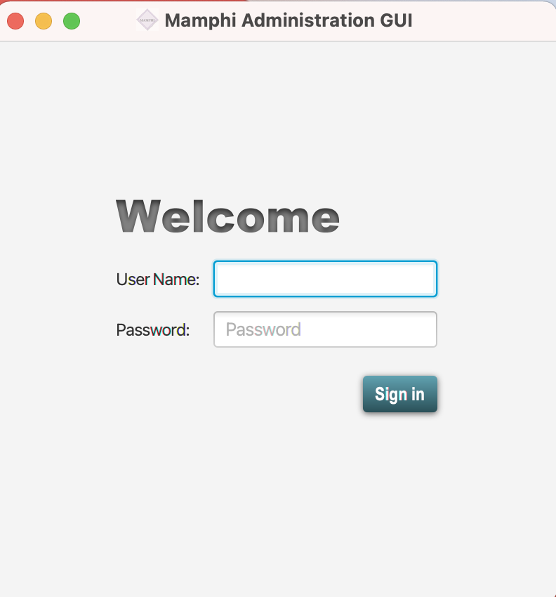

# mamphi-gui

# Table of content
1. [Description](#Description)
2. [SQLite Database reproduction](#database)
3. [Get Started](#start)
4. [TODO](#TODO)

## Description
This is a sample project implementing a graphical user interface application for the management of a clinical trial.

The Goal of the so implemented application is to allow authorized administrator to easily manipulate the data of the trial stored in a data base.

In this version of the application the mentioned data are query from a SQLite Data Base.

## SQLite Database reproduction <a name="database"></a>

As mentioned before, this application get data from a sqlite Database and display it. 
So in order to run the application, the database have to be created and saved locally. 

This can be archived using the script named `mamphidb.db.sql` provided with this repository. 

For time saving, the SQLite Editor [DB Browser for SQLite](https://sqlitebrowser.org/) is recommended for this purpose.

By interest, the samples SQL statements used to get manage the data from the database can be found in the script `Statements.sql`.

## Get Started <a name="start"></a>


Clone the project.

```shell
git clone https://github.com/ngninbo/mamphi-gui.git
```


Import the project in our favorite IDE.


Set up the database filename (e.g. name of the SQLite file containing the database) in `src/main/java/de/fhdo/master/mi/sms/project/mamphi/utils/MamphiStatements.java`
This file name is needed for a successful SQLite JDBC driver connection.

Run the application using the following command.

```shell
mvn clean install javafx:run
```

Sign in using the following credentials:


```text
username: demo

password: demo
```

After started up, the application may look as followed:



# TODO
- Refactor code
- On Monitor plan view, make sure the visit date are displayed each in a row
- Use FXML to Create the User Interface
- Extract styling/Extend `application.css` file
- Pass database file name as command line argument by editing `Run Configuration` or
- Define database file name as property in `pom.xml` file
- Make sure the application use the configured database file name on start up
- Apply translation on every database column, field, constants, variable etc.
- Last but not least, Unit tests

